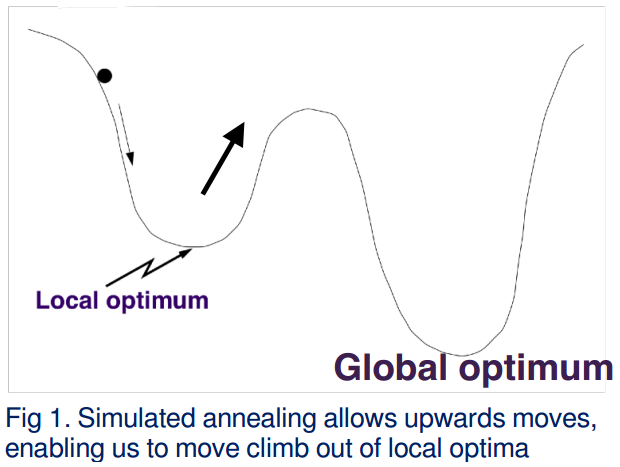
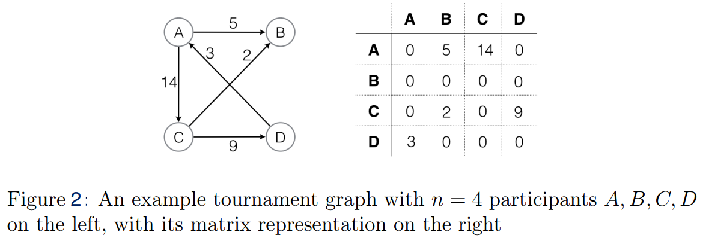
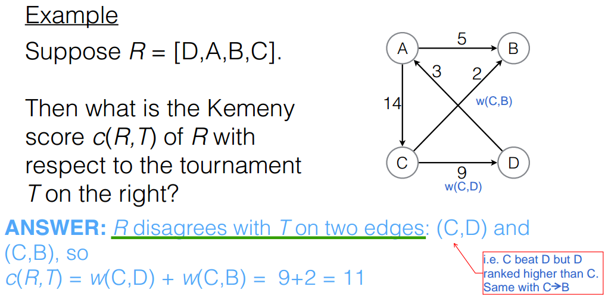

Simulated Annealing
===================

A Java program that implements simulated annealing to produce a ranking of tournament participants.
---------------------------------------------------------------------------------------------------

**Simulated annealing (SA)**

SA is a probabalistic algoritjm for approximating the global optimum in an optimisation problem.

It is based on the observation that when solids are heated past their melting point and then cooled, 
the energy in the system falls in a staggered way, with small uphill moves as the crystals form and 
rearrange.

You can read more about SA here:
https://www.geeksforgeeks.org/simulated-annealing/

A key component of SA is that it allows uphill moves, so we can avoid getting stuck in a local optimum.

Ranking participants of a tournament
------------------------------------

This program applies the SA algorithm to the problem of finding a ranking of participants in a tournament.

We can picture a tournament as a weighted directed graph where nodes are participants, and edges are the 
result of matches between those participants, with the weights representing the margin of victory.

**Kemeny Score**

This program uses Kemeny Scores to measure the amount of disagreement of a ranking with a given tournament,
calculated by summing the weights of all edges where the ranking disagrees with the tournament.

**Tournament Data**

The tournament this program is tuned on is the 1984 World Formula 1 motor racing championship. This was a
tournament with 35 participants (thus 35 factorial possible rankings).

The data is found in the file **'Formula_One_1984.wmg'**, encoded in the following format:

* line 1: contains the number of participants in the tournament
* lines 2-36: contain an identifying number for each participant, along with their real names
* line 37: contains information about how the data has been generated (irrelevant to this program)
* The remaining lines are of the format (weight, participant 1, participant 2), where weight gives the number of matches that participant 1 won more than particpant 2 where they competed against each other.

e.g. line 40:

       14,9,6

This means the edge in the graph from participant #9 to participant #6 has weight 14. 
If a = the number of matches where participant #9 won against participant #6, and b is the reverse, then a - b = 14, so participant #9 beat #6 by 14 matches.

__________________

Run the program
---------------

1. Compile all files:

       javac *.java

2. Run SimulateAnnealing algorithm once with the tournament data:

       java -Xmx1g SimulatedAnnealing tournament_data/Formula_One_1984.wmg

This will output the resulting ranking, along with some stats about the run, such as the Kemeny score of
the solution, and the number of uphill moves completed during the run.

